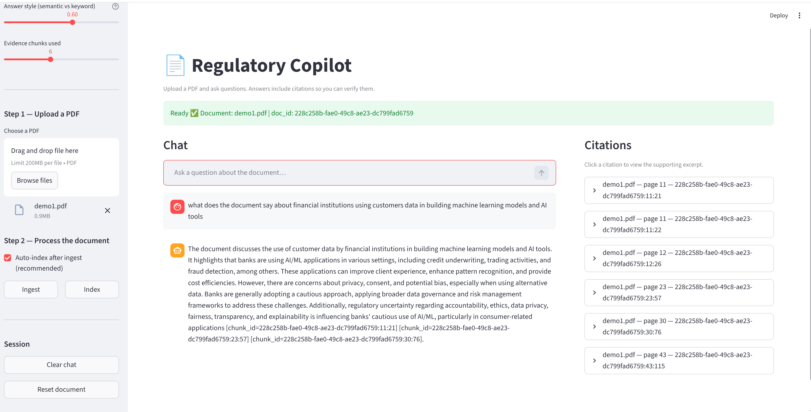
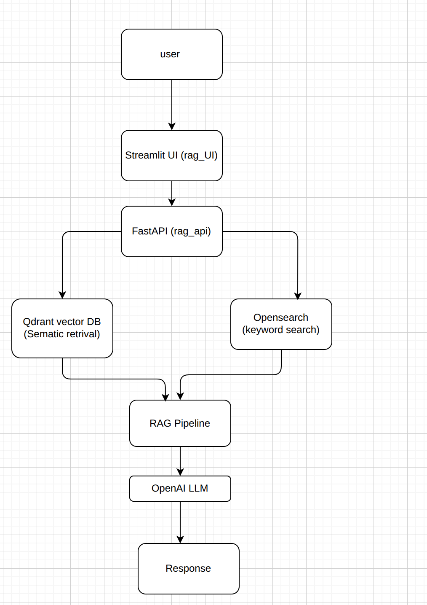

# Regulatory Compliance RAG Copilot (LLM + Kubernetes + AWS)

An end-to-end Retrieval-Augmented Generation (RAG) system that allows users to query financial regulatory documents using natural language. The system combines semantic search with large language models to generate contextual answers.

The application is containerised with Docker and deployed on AWS EKS using Kubernetes, with images stored in Amazon ECR.

## Streamlit UI Demo


<p align="center">
  
</p>

## Architecture

<p align="center">
  
</p>


### infrastructure 

```
AWS ECR
 ├── rag-api image
 └── rag-ui image

AWS EKS Cluster
 ├── rag-api Deployment
 ├── rag-ui Deployment
 ├── Qdrant
 └── OpenSearch

Kubernetes Services
 ├── ClusterIP services (internal communication)
 └── LoadBalancer service for UI
```

## Features

- Retrieval-Augmented Generation (RAG)
- Hybrid search (vector + keyword retrieval)
- Semantic embeddings with OpenAI
- FastAPI inference service
- Streamlit user interface
- Qdrant vector database
- OpenSearch keyword index
- Docker containerisation
- Kubernetes deployment on AWS EKS
- Public LoadBalancer service for UI access

## Tech Stack

Machine Learning / NLP
- OpenAI API
- Retrieval-Augmented Generation (RAG)

Backend
- FastAPI
- Python

Vector Database
- Qdrant

Search Engine
- OpenSearch

Frontend
- Streamlit

Infrastructure
- Docker
- Kubernetes
- AWS EKS
- Amazon ECR


## Running locally
- Clone the respirotory 
- From root repo run to build containers
```
docker compose up -d --build
```
- once stack is up access
- API
```
http://localhost:8000/docs
```
- UI
```
http://localhost:8501
```
- Opensearch
```
http://localhost:9200
```
- Qdrant
```
http://localhost:6333/dashboard
```

## Cloud Deployment Steps

### Build the API and Streamlit UI images 
```
docker build -f dockerfile.api -t rag-api .
docker build -f dockerfile.ui -t rag-ui .
```
### Push the images to AWS ECR
```
docker tag rag-api:latest <ECR_URI>/rag-api:latest
docker push <ECR_URI>/rag-api:latest
```
### Create EKS cluster 
```
eksctl create cluster \
  --name rag-cluster \
  --region eu-west-2 \
  --node-type t3.large \
  --nodes 2 \
  --managed
  
```
### Deploy kubernetes stack 
```
kubectl apply -f k8s/rag-stack.yaml
```
### Access the application
```
kubectl get svc -n rag
```
Open loadbalancer URL


## Future Improvements

- Add Helm charts for Kubernetes deployment
- Introduce CI/CD pipeline (GitHub Actions)
- Add monitoring with Prometheus + Grafana
- Implement authentication layer
- Improve hybrid search ranking

## License
This project is licensed under the MIT License.