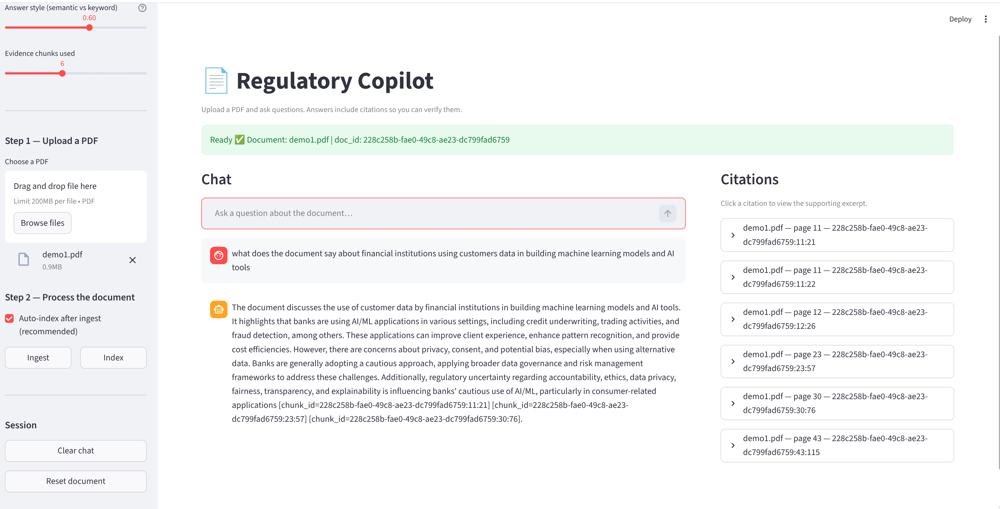
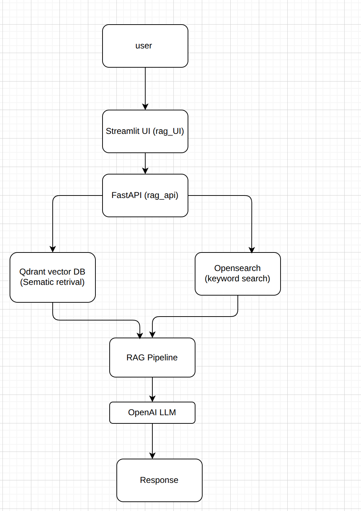
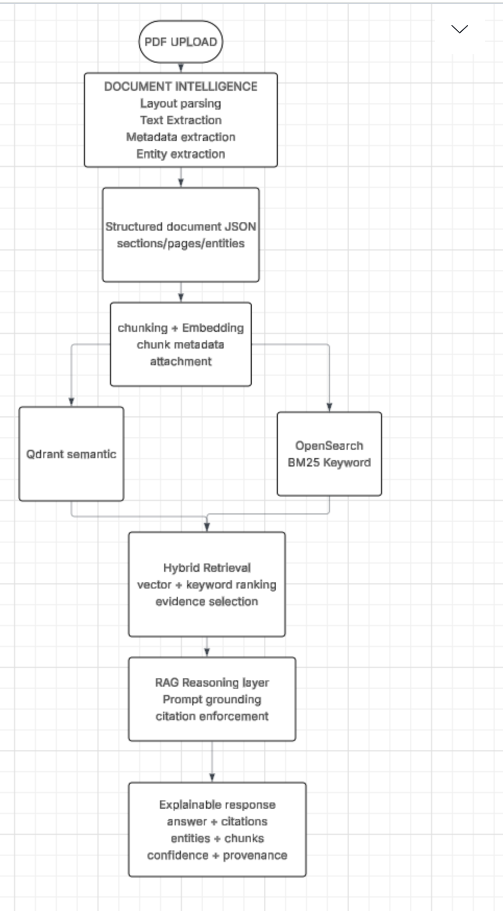
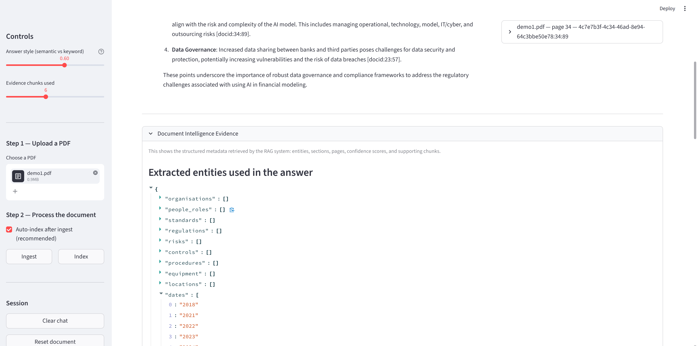
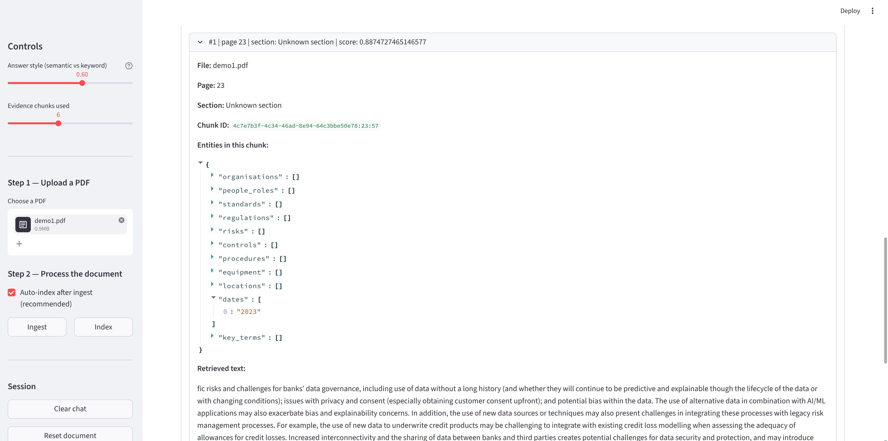

# Regulatory Compliance RAG Copilot  with Document Intelligence (LLM + Kubernetes + AWS)

An end-to-end Retrieval-Augmented Generation (RAG) system that allows users to query financial regulatory documents using natural language. The system combines semantic search with large language models to generate contextual answers.

The application is containerised with Docker and deployed on AWS EKS using Kubernetes, with images stored in Amazon ECR.

## Streamlit UI Demo


<p align="center">
  
</p>

## Architecture

<p align="center">
  
</p>

## Document Intelligence Upgrade

The system has been extended beyond traditional RAG into a document intelligence pipeline.

Instead of performing retrieval purely on raw text chunks, uploaded regulatory documents are processed through layout-aware extraction, metadata generation, and entity-aware chunking before hybrid retrieval.

This enables:

- Explainable retrieval with supporting evidence
- Structured document metadata
- Entity-aware search and reasoning
- Improved grounding and citation transparency
- Visibility into retrieved chunks and confidence

## Document Intelligence Workflow

<p align="center">
  
</p>

## Explainable Evidence UI
The upgraded interface exposes the retrieval process to users by displaying supporting citations, extracted entities, and retrieved chunks used during answer generation.
<p align="center">
  
</p>

<p align="center">
  
</p>

<p align="center">
  
</p>


### infrastructure 

```
AWS ECR
 ├── rag-api image
 └── rag-ui image

AWS EKS Cluster
 ├── rag-api Deployment
 ├── rag-ui Deployment
 ├── Qdrant
 └── OpenSearch

Kubernetes Services
 ├── ClusterIP services (internal communication)
 └── LoadBalancer service for UI
```

## Features

### Document Intelligence
- Layout-aware PDF processing
- Metadata and section extraction
- Entity extraction from regulatory documents
- Evidence visibility and provenance tracking

### Retrieval and Reasoning
- Retrieval-Augmented Generation (RAG)
- Hybrid search (semantic + keyword retrieval)
- OpenAI-powered grounded responses
- Citation-enforced prompting
- Supporting chunk inspection

### System and Infrastructure
- FastAPI inference service
- Streamlit user interface
- Qdrant vector database
- OpenSearch keyword index
- Docker containerisation
- Kubernetes deployment on AWS EKS
- Amazon ECR image registry
- Public LoadBalancer access

## Tech Stack

Machine Learning / NLP
- OpenAI API
- Retrieval-Augmented Generation (RAG)

Backend
- FastAPI
- Python

Vector Database
- Qdrant

Search Engine
- OpenSearch

Frontend
- Streamlit

Infrastructure
- Docker
- Kubernetes
- AWS EKS
- Amazon ECR


## Running locally
- Clone the respirotory 
- From root repo run to build containers
```
docker compose up -d --build
```
- once stack is up access
- API
```
http://localhost:8000/docs
```
- UI
```
http://localhost:8501
```
- Opensearch
```
http://localhost:9200
```
- Qdrant
```
http://localhost:6333/dashboard
```

## Cloud Deployment Steps

### Build the API and Streamlit UI images 
```
docker build -f dockerfile.api -t rag-api .
docker build -f dockerfile.ui -t rag-ui .
```
### Push the images to AWS ECR
```
docker tag rag-api:latest <ECR_URI>/rag-api:latest
docker push <ECR_URI>/rag-api:latest
```
### Create EKS cluster 
```
eksctl create cluster \
  --name rag-cluster \
  --region eu-west-2 \
  --node-type t3.large \
  --nodes 2 \
  --managed
  
```
### Deploy kubernetes stack 
```
kubectl apply -f k8s/rag-stack.yaml
```
### Access the application
```
kubectl get svc -n rag
```
Open loadbalancer URL


## Future Improvements

- Add Helm charts for Kubernetes deployment
- Introduce CI/CD pipeline (GitHub Actions)
- Add monitoring with Prometheus + Grafana
- Implement authentication layer
- Improve hybrid search ranking

## License
This project is licensed under the MIT License.